Io_lib:  Version 1.15.0
=======================

Io_lib is a library of file reading and writing code to provide a general
purpose SAM/BAM/CRAM, trace file (and Experiment File) reading
interface.  Programmatically {S,B,CR}AM can be manipulated using the
scram_*() API functions while DNA Chromatogram ("trace") files  can be
read using the read_reading() function.

It has been compiled and tested on a variety of unix systems, MacOS X
and MS Windows.

The directories below here contain the io_lib code. These support the
following file formats:

	SAM/BAM sequence files
	CRAM sequence files
	SCF trace files
	ABI trace files
	ALF trace files
	ZTR trace files
	SFF trace archives
	SRF trace archives
	Experiment files
	Plain text files

These link together to form a single "libstaden-read" library supporting
all the file formats via a single read_reading (or fread_reading or
mfread_reading) function call and analogous write_reading functions
too. See the file include/Read.h for the generic 'Read' structure.

See the CHANGES for a summary of older updates or git logs for the
full details.

Version 1.15.0 (14th April 2023)
--------------

The first release that no longer warns about CRAM 3.1 being draft.
No changes have been made to the format and it is fully compatible
with the 1.14.x releases.

Technology Demo: 4.0
====================

The current official GA4GH CRAM version is 3.1.

The current default CRAM output is 3.0, for maximum compatibility with
other tools.  Use the -V3.1 option to select CRAM 3.1 if needed.

For purposes of *EVALUATION ONLY* this release of io_lib also includes
an experimental CRAM version 4.0.  The format very likely to change
and should not be used for production data.  CRAM 4.0 includes format
modifications, such as 64-bit sizes, deduplication of read names,
orientation changes of quality strings and a revised variable sized
integer encoding.  It can be enabled using scramble -V4.0

Enabling CRAM 3.1 or 4.0 will also enable the new codecs.
Which codecs are used also depends on the profile specified (eg via
"-X small").  Some of the new codecs are considerably slower,
especially at decompression, but by default CRAM 3.1 aims to be
comparable speed to 3.0.  Note the profiles also change the
granularity of random access (1k, 10k, 25k, 100k for fast, normal,
small and archive respectively).

Here are some example file sizes and timings with different codecs and
levels on 10 million 150bp NovaSeq reads, single threaded.  Decode
timing is checked using "scram_flagstat -b".

Table produced with Io_lib 1.15.0 on a laptop with Intel i7-1185G7
CPU running Ubuntu 20.04 under Microsoft's WSL2.

|Scramble opts.      |Size(MB) |Enc(s)|Dec(s)|Codecs used                |
|--------------------|--------:|-----:|-----:|---------------------------|
|-O bam (default)    |    518.2|  65.8|   5.7|bgzf(zlib)                 |
|-O bam -1           |    584.5|  17.4|   3.5|bgzf(libdeflate)           |
|-O bam (default)    |    524.6|  27.8|   2.9|bgzf(libdeflate)           |
|-O bam -9           |    486.5| 810.4|   3.0|bgzf(libdeflate)           |
||||||
|-V2.0 -X fast       |    294.5|  23.1|   7.8|(default, level 1)         |
|-V2.0 (default)     |    252.3|  32.9|   8.0|(default)                  |
|-V2.0 -X small      |    208.0|  85.2|  23.5|bzip2                      |
|-V2.0 -X archive    |    206.0|  88.1|  24.3|bzip2                      |
||||||
|-V3.0 -X fast       |    241.1|  19.7|   8.5|(default, level 1)         |
|-V3.0 (default)     |    208.5|  23.0|   8.8|(default)                  |
|-V3.0 -X small      |    201.7|  60.0|  14.5|bzip2                      |
|-V3.0 -X archive    |    199.9|  61.7|  13.6|bzip2                      |
||||||
|-V3.1 -X fast       |    237.1|  22.1|   7.9|rANS++                     |
|-V3.1 (default)     |    175.8|  26.7|   8.9|rANS++,tok3                |
|-V3.1 -X small      |    166.9|  47.9|  24.6|rANS++,tok3,fqz            |
|-V3.1 -X archive    |    162.2|  72.5|  20.5|rANS++,tok3,fqz,bzip2,arith|
||||||
|-V4.0 -X fast       |    227.5|  16.6|   6.2|rANS++                     |
|-V4.0 (default)     |    172.8|  19.7|   6.3|rANS++,tok3                |
|-V4.0 -X small      |    162.3|  34.8|  20.2|rANS++,tok3,fqz            |
|-V4.0 -X archive    |    157.9|  82.2|  26.2|rANS++,tok3,fqz,bzip2,arith|

```mermaid
gantt
    title 10 million Illumina NovaSeq records
    todayMarker off
    dateFormat  X
    axisFormat %s

    section BAM
    -5 zlib   66s / 6s   : 0,518
    -1,       17s / 3s   : 0,584
    -5,       28s / 3s   : 0,525
    -9,      810s / 3s   : 0,486
    - : 0,0

    section CRAM 2.0
    fast,     23s /  8s  : 0,294
    normal,   33s /  8s  : 0,253
    small,    85s / 23s  : 0,208
    archive,  88s / 24s  : 0,206
    - : 0,0

    section CRAM 3.0
    fast,     20s /  8s  : 0,241
    normal,   23s /  9s  : 0,208
    small,    60s / 14s  : 0,202
    archive,  62s / 14s  : 0,200
    - : 0,0

    section CRAM 3.1
    fast,     22s /  8s  : 0,237
    normal,   27s /  9s  : 0,176
    small,    48s / 25s  : 0,167
    archive,  72s / 21s  : 0,162
    - : 0,0

    section CRAM 4.0
    fast,     17s /  6s  : 0,227
    normal,   20s /  6s  : 0,173
    small,    35s / 20s  : 0,162
    archive,  82s / 26s  : 0,158
```

With 1 million aligned PacBio Revio records, on the same system.  Also
using one thread only:

|Scramble opts.      |Size(MB) |Enc(s)|Dec(s)|Codecs used                |
|--------------------|--------:|-----:|-----:|---------------------------|
|-O bam -1           |     3061|  97.5|  16.0|bgzf(libdeflate)           |
|-O bam (default)    |     2891| 128.4|  15.3|bgzf(libdeflate)           |
|-O bam -9           |     2651|2314.7|  16.4|bgzf(libdeflate)           |
||||||
|-V2.0 -X fast       |     1334|  80.3|  23.9|(default, level 1)         |
|-V2.0 (default)     |     1206| 111.2|  25.1|(default)                  |
|-V2.0 -X small      |     1048| 276.3|  98.7|bzip2                      |
|-V2.0 -X archive    |     1042| 294.2|  98.5|bzip2                      |
||||||
|-V3.0 -X fast       |     1164|  67.3|  18.5|(default, level 1)         |
|-V3.0 (default)     |     1016|  64.5|  26.4|(default)                  |
|-V3.0 -X small      |     1003| 124.8|  32.2|bzip2                      |
|-V3.0 -X archive    |      997| 162.4|  34.7|bzip2                      |
||||||
|-V3.1 -X fast       |     1161|  56.8|  17.6|rANS++                     |
|-V3.1 (default)     |      943|  66.0|  18.5|rANS++,tok3                |
|-V3.1 -X small      |      892| 142.7|  81.8|rANS++,tok3,fqz            |
|-V3.1 -X archive    |      875| 288.9|  97.6|rANS++,tok3,fqz,bzip2,arith|
||||||
|-V4.0 -X fast       |     1160|  53.6|  17.6|rANS++                     |
|-V4.0 (default)     |      941|  60.9|  17.7|rANS++,tok3                |
|-V4.0 -X small      |      892| 137.6|  78.8|rANS++,tok3,fqz            |
|-V4.0 -X archive    |      874| 283.6|  87.9|rANS++,tok3,fqz,bzip2,arith|

```mermaid
gantt
    title 1 million PacBio Revio records
    todayMarker off
    dateFormat  X
    axisFormat %s

    section BAM
    -1,       97s / 16s  : 0,3061
    -5,      128s / 15s  : 0,2981
    -9,     2315s / 16s  : 0,2651
    - : 0,0

    section CRAM 2.0
    fast,     80s / 24s  : 0,1334
    normal,  111s / 25s  : 0,1206
    small,   276s / 32s  : 0,1048
    archive, 294s / 35s  : 0,1042
    - : 0,0

    section CRAM 3.0
    fast,     67s / 18s  : 0,1164
    normal,   64s / 26s  : 0,1016
    small,   125s / 32s  : 0,1003
    archive, 162s / 35s  : 0, 997
    - : 0,0

    section CRAM 3.1
    fast,     57s / 18s  : 0,1161
    normal,   66s / 18s  : 0, 943
    small,   143s / 82s  : 0, 892
    archive, 289s / 97s  : 0, 875
    - : 0,0

    section CRAM 4.0
    fast,     54s / 18s  : 0,1160
    normal,   61s / 18s  : 0, 941
    small,   128s / 79s  : 0, 892
    archive, 284s / 88s  : 0, 874
```

Building
========

Prerequisites
-------------

You will need a C compiler, a Unix "make" program plus zlib, bzip2 and
lzma libraries and associated development packages (including C header
files).  The appropriate operating system package names and comands
differ per system.  On Debian Linux derived systems use the command
below (or build and install your own copies from source):

  sudo apt-get install make zlib1g-dev libbz2-dev liblzma-dev

On RedHat derived systems the package names differ:

  sudo yum install make zlib-devel bzip2-devel xz-devel

Zlib
----

This code makes heavy use of the Deflate algorithm, assuming a Zlib
interface.  The native Zlib bundled with most systems is now rather
old and better optimised versions exist for certain platforms
(e.g. using the SSE instructions on Intel and AMD CPUs).

Therefore the --with-zlib=/path/to/zlib configure option may be used
to point to a different Zlib.  I have tested it with the vanilla zlib,
Intel's zlib and CloudFlare's Zlib.  Of the three it appears the
CloudFlare one has the quickest implementation, but mileage may vary
depending on OS and CPU.  

CloudFlare: https://github.com/cloudflare/zlib
Intel:      https://github.com/jtkukunas/zlib
Zlib-ng:    https://github.com/Dead2/zlib-ng

The Zlib-ng one needs configuring with --zlib-compat and when you
build Io_lib you will need to define -DWITH_GZFILEOP too.  It also
doesn't work well when used in conjunction with LD_PRELOAD. Therefore
I wouldn't recommend it for now.

If you are using the CloudFlare implementation, you may also want to
disable the CRC implementation in this code if your CloudFlare zlib
was built with PCLMUL support as their implementation is faster.
Otherwise the CRC here is quicker than Zlib's own version.
Building io_lib with the internal CRC code disabled is done
with ./configure --disable-own-crc (or CFLAGS=-UIOLIB_CRC).

Libdeflate
----------

The BAM reading and writing also has optional support for the
libdeflate library (https://github.com/ebiggers/libdeflate).  This can
be used instead of an optimised zlib (see above), and generally is
slightly faster.  Build using:

    ./configure --with-libdeflate=/path

Git clone
---------

We recommend building from a release tarball, which has the configure
script already created for you.  However if you wish to build from the
latest code then use "git clone -r" to clone recursively to get the
htscodecs submodule (or follow up a normal "git clone" with
"git submodule update --init --recursive").  You will then need to
create the configure script using autoreconf in both io_lib and
htscodecs directories.  This is easiest achieved using the supply
bootstrap script.

  ./bootstrap

The autotools programs may not be on your system.  If it fails, then
install autoconf, automake and libtool packages; see above for example
OS-specific installation commands.

Linux
-----

We use the GNU autoconf build mechanism.

To build:

1. ./configure

"./configure --help" will give a list of the options for GNU autoconf. For
modifying the compiler options or flags you may wish to redefine the CC or
CFLAGS variable.

Eg (in sh or bash):
   CC=cc CFLAGS=-g ./configure

2. make (or gmake)

This will build the sources.

CFLAGS may also be changed a build time using (eg):
    make 'CFLAGS=-g ...'

3. make install

The default installation location is /usr/local/bin and /usr/local/lib. These
can be changed with the --prefix option to "configure".

Windows
-------

Under Microsoft Windows we recommend the use of MSYS and MINGW as a
build environment.

These contain enough tools to build using the configure script as per
Linux. The latest msys can be downloaded here:

   http://repo.msys2.org/distrib/msys2-x86_64-latest.exe

Once installed and setup ("pacman -Syu"; close window & relaunch msys;
"pacman -Syu" again), install mingw64 compilers via "pacman -S
--needed man base-devel git mingw-w64-x86_64-toolchain".

This should then be sufficient to configure and compile.  However note
that you may need to use "./configure --disable-shared" for the test
harness to work due to deficiences in the libtool wrapper script.

If you wish to use Microsoft Visual Studio you may need to add the
MSVC_includes subdirectory to your C include search path.  This
adds several missing header files (eg unistd.h and sys/time.h) needed
to build this software.  We do not have a MSVC project file available
and have not tested the build under this environment for a number of
years.

In this case you will also need to copy io_lib/os.h.in to io_lib/os.h
and either remove the @SET_ENDIAN@ and adjacent @ lines (as these are
normally filled out for you by autoconf) or add -DNO_AUTOCONF to your
compiler options.

The code should also build cleanly under a cross-compiler.  This has
not been tested recently, but a past successful invocation was:

    ./configure \
            --host=x86_64-w64-mingw32 \
            --prefix=$DIST \
            --with-io_lib=$DIST \
            --with-tcl=$DIST/lib \
            --with-tk=$DIST/lib \
            --with-tklib=$DIST/lib/tklib0.5 \
            --with-zlib=$DIST \
            LDFLAGS=-L$DIST/lib

with $DIST being pre-populated with already built and installed 3rd
party dependencies, some from MSYS mentioned above.

Libbsc
------

This is experimental, just to see what we can get with a high quality
compression engine in CRAM.  It's hard to build right now, especially
given it's a C++ library and our code is C.  The hacky solution now
is (linux) e.g.:

  ../configure \
    CPPFLAGS=-I$HOME/ftp/compression/libbsc \
    LDFLAGS="-L$HOME/ftp/compression/libbsc -fopenmp" \
    LIBS=-lstdc++

Enable it using scramble -J, but note this requires experimental CRAM
versions 3.1 or 4.0.

** Neither of these should be used for production data. **

MacOS X
-------

The configure script should work by default, but if you are attempting
to build FAT binaries to work on both i386 and ppc targets you'll need
to disable dependency tracking. Ie:

    CFLAGS="-arch i386 -arch ppc" LDFLAGS="-arch i386 -arch ppc" \
      ../configure --disable-dependency-tracking
